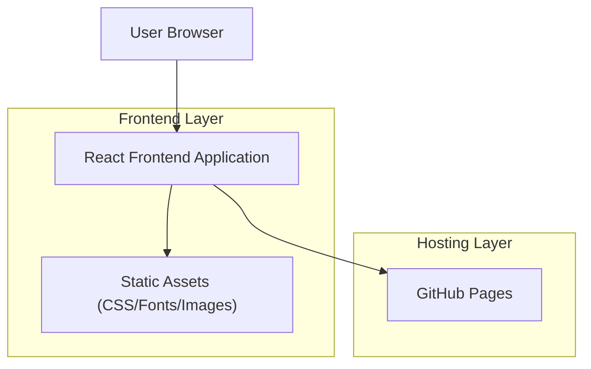

## 1.Architecture design

## 2.Technology Description
- Frontend: React@18 + Vite + TypeScript
- Backend: None
- Styling: 纯 CSS（建议从现有内联 CSS 拆分为全局样式文件或 CSS Modules，以确保视觉 1:1）

## 3.Route definitions
| Route | Purpose |
|-------|---------|
| / | 首页：渲染与当前静态 `index.html` 一致的视觉与链接行为 |

> 兼容 GitHub Pages 说明（构建/路由）：
> - 若仅保留单页（/），无需前端路由即可避免刷新 404 问题。
> - 构建时需确保资源路径在 GitHub Pages 下可正确加载（例如使用相对 base 路径策略），并让产物目录与 GitHub Pages workflow 的上传目录保持一致（例如上传 `dist/`）。

## 6.Data model(if applicable)
不涉及（纯静态前端展示与外链跳转）。
